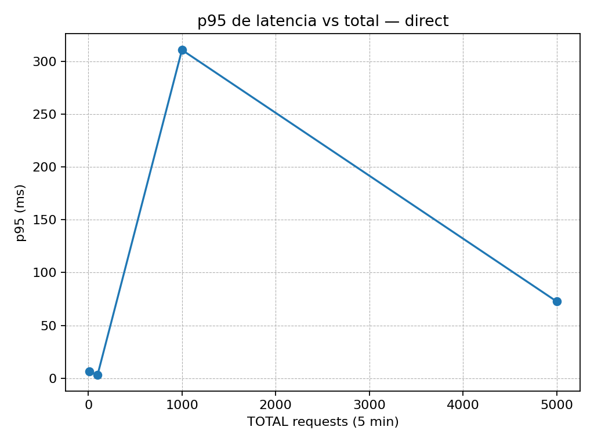
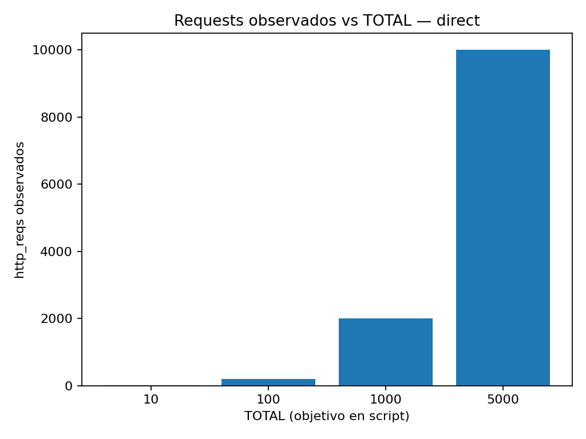
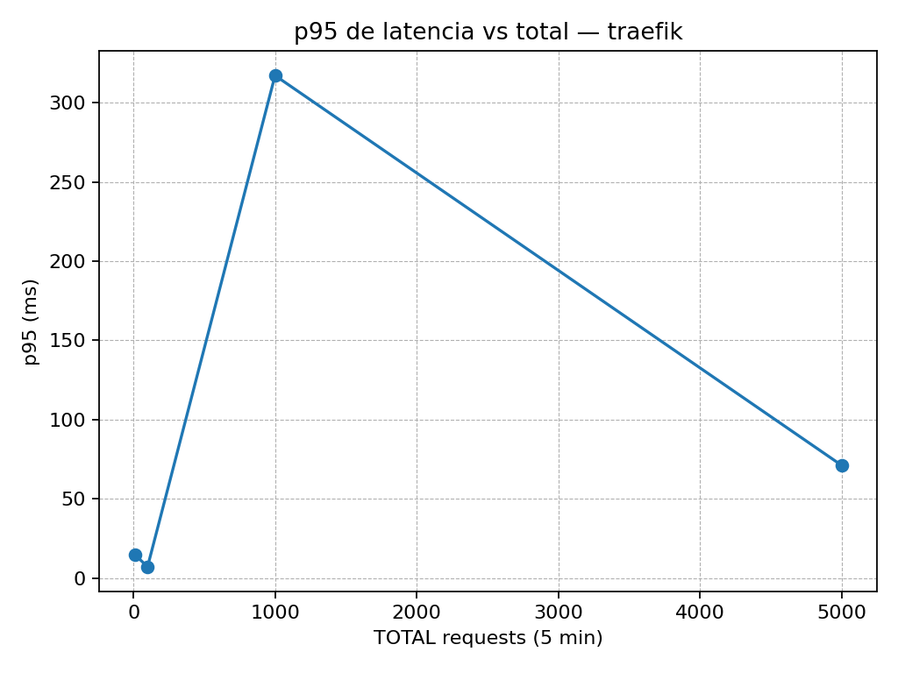
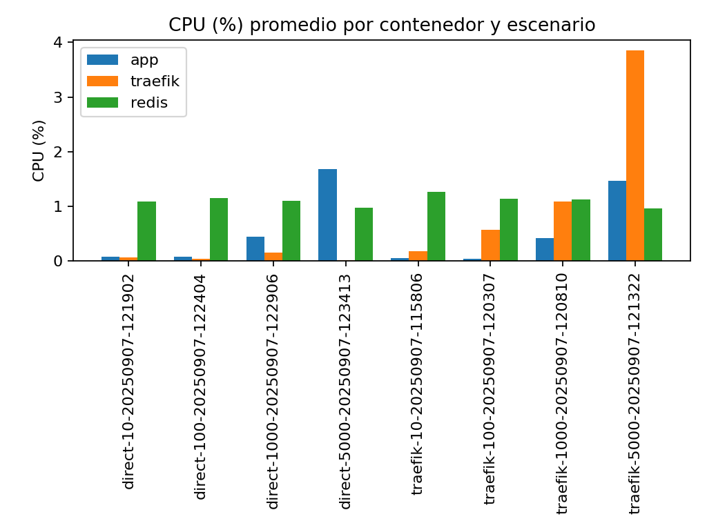
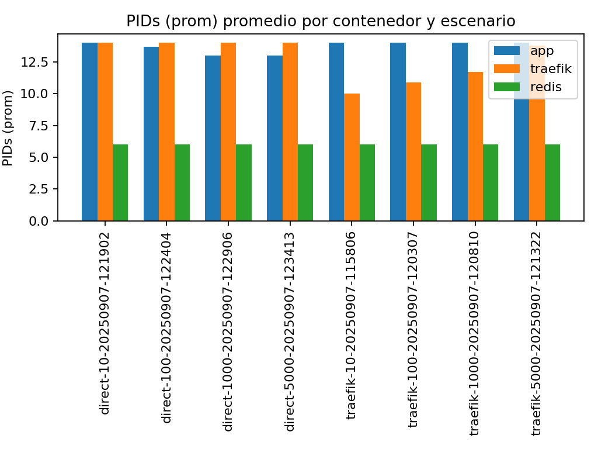

# Reporte de cargas y métricas

## Resumen k6 (p95 y requests)

| label | total | http_reqs | p95_ms |
|---|---:|---:|---:|
| direct | 10 | 20 | 6.34 |
| direct | 100 | 200 | 3.33 |
| direct | 1000 | 2000 | 310.82 |
| direct | 5000 | 10000 | 72.68 |
| traefik | 10 | 20 | 14.85 |
| traefik | 100 | 200 | 7.22 |
| traefik | 1000 | 2000 | 317.11 |
| traefik | 5000 | 10000 | 71.20 |

### Gráficos de latencia y volumen

## CPU y PIDs por contenedor conocido (app / traefik / redis)

